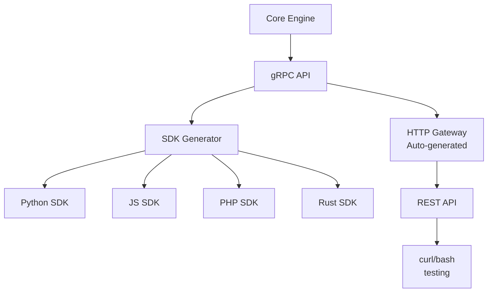

## **Great question! Let me give you the REAL answer based on what developers actually prefer:**

## **The Honest Truth: They Want BOTH (But for Different Reasons)**

```
┌─────────────────────────────────────────────────────────────┐
│                    DEVELOPER PREFERENCES                     │
├───────────────┬─────────────────────────┬───────────────────┤
│    Language   │   Prefers SDK?          │   Why?            │
├───────────────┼─────────────────────────┼───────────────────┤
│ Python        │   ✅ YES - Strongly      │ "Pythonic" way    │
│ JavaScript    │   ✅ YES - Strongly      │ NPM is standard   │
│ PHP           │   ✅ YES                  │ Composer expect   │
│ Rust          │   ✅ YES                  │ Cargo makes it easy│
│ Java          │   🤷 Both fine           │ Can go either way │
│ Go            │   ✅ Direct import        │ No network!       │
│ Curl/Testing  │   ❌ HTTP API            │ For testing       │
└───────────────┴─────────────────────────┴───────────────────┘
```

## **What Developers ACTUALLY Want**

### **1. Python Developers**
```python
# What they WANT (SDK style)
from crydensync import CrydenSync

auth = CrydenSync("localhost:50051")
user = auth.login("[email]", "pass")  # Clean!

# NOT this (raw HTTP)
import requests
resp = requests.post("http://localhost:8080/auth/login", 
                    json={"email": "...", "password": "..."})
user = resp.json()  # Ugly!
```

### **2. JavaScript/Node Developers**
```javascript
// What they WANT (NPM package)
import { CrydenSync } from 'crydensync';

const auth = new CrydenSync('localhost:50051');
const user = await auth.login(email, password);  // Clean!

// NOT this
const response = await fetch('http://localhost:8080/auth/login', {
  method: 'POST',
  headers: { 'Content-Type': 'application/json' },
  body: JSON.stringify({ email, password })
});
const user = await response.json();
```

### **3. PHP Developers**
```php
// What they WANT (Composer package)
use CrydenSync\Client;

$auth = new Client('localhost:50051');
$user = $auth->login($email, $password);  // Clean!

// NOT this
$ch = curl_init('http://localhost:8080/auth/login');
curl_setopt($ch, CURLOPT_POST, true);
// ... 10 lines of curl config ...
```

## **The REAL Decision: SDK vs HTTP API**

### **SDK (Client Library) - What They Prefer**
```python
# ✅ Pros:
# - Feels native to their language
# - Type hints/autocomplete
# - Error handling baked in
# - Version management (pip/npm/composer)
# - One import, everything works

# Cons:
# - You have to write/maintain multiple SDKs
# - Need to version all of them
```

### **HTTP API - What They'll Use Sometimes**
```bash
# ✅ Pros:
# - Works everywhere
# - Easy to test with curl
# - No SDK needed for simple cases

# Cons:
# - Raw JSON parsing
# - Manual error handling
# - No autocomplete
# - More boilerplate
```

## **The Smart Approach: SDK FIRST, HTTP Second**

### **What You Should Build**



## **How It Works**

### **Step 1: Define Your gRPC Service**
```protobuf
// auth.proto
service AuthService {
  rpc Login(LoginRequest) returns (LoginResponse) {}
  rpc ValidateToken(TokenRequest) returns (User) {}
  rpc Register(RegisterRequest) returns (User) {}
}

message LoginRequest {
  string email = 1;
  string password = 2;
}
```

### **Step 2: Generate SDKs Automatically**
```bash
# Your build process
protoc --python_out=./sdk/python auth.proto
protoc --js_out=./sdk/javascript auth.proto
protoc --php_out=./sdk/php auth.proto
protoc --rust_out=./sdk/rust auth.proto

# Now you have SDKs for ALL languages automatically!
```

### **Step 3: Add a Tiny Wrapper for Polish**

#### **Python SDK (Auto-generated + Your sugar)**
```python
# sdk/python/crydensync/__init__.py
from .grpc_client import AuthServiceClient  # Auto-generated

class CrydenSync:
    def __init__(self, host="localhost:50051"):
        self.client = AuthServiceClient(host)
    
    def login(self, email, password):
        # Auto-generated gRPC call!
        return self.client.Login(email, password)
    
    def validate_token(self, token):
        return self.client.ValidateToken(token)
```

#### **JavaScript SDK (Auto-generated)**
```javascript
// sdk/javascript/index.js
const grpc = require('@grpc/grpc-js');
const protoLoader = require('@grpc/proto-loader');

class CrydenSync {
    constructor(host = 'localhost:50051') {
        // Load proto and create client
        this.client = new AuthService(host);
    }
    
    async login(email, password) {
        return new Promise((resolve, reject) => {
            this.client.login({ email, password }, (err, res) => {
                if (err) reject(err);
                else resolve(res);
            });
        });
    }
}
```

## **What Developers Actually Write**

### **Python Developer (Using Your SDK)**
```python
# What they write
from crydensync import CrydenSync

auth = CrydenSync()  # Defaults to localhost:50051

@app.route('/login', methods=['POST'])
def login():
    data = request.json
    try:
        # Clean, native Python
        tokens = auth.login(data['email'], data['password'])
        return jsonify(tokens)
    except AuthError as e:
        return jsonify({'error': str(e)}), 401
```

### **JavaScript Developer**
```javascript
// What they write
import { CrydenSync } from 'crydensync';

const auth = new CrydenSync();

app.post('/login', async (req, res) => {
    try {
        // Clean, async/await
        const tokens = await auth.login(req.body.email, req.body.password);
        res.json(tokens);
    } catch (err) {
        res.status(401).json({ error: err.message });
    }
});
```

### **PHP Developer**
```php
// What they write
use CrydenSync\CrydenSync;

$auth = new CrydenSync();

$app->post('/login', function($request, $response) use ($auth) {
    try {
        $tokens = $auth->login(
            $request->getParam('email'),
            $request->getParam('password')
        );
        return $response->withJson($tokens);
    } catch (AuthException $e) {
        return $response->withStatus(401)->withJson(['error' => $e->getMessage()]);
    }
});
```

## **The HTTP API is Just a Bonus**

```bash
# For testing with curl
curl -X POST http://localhost:8080/auth/login \
  -H "Content-Type: application/json" \
  -d '{"email": "test@test.com", "password": "pass"}'

# For quick scripts
wget --post-data '{"email":"test@test.com"}' http://localhost:8080/auth/login

# For languages without SDK (rare these days)
```

## **Why SDKs Win for Your Use Case**

| Factor | SDK | HTTP API |
|--------|-----|----------|
| **Native feel** | ✅ Feels like Python/JS | ❌ Feels like REST |
| **Type safety** | ✅ Type hints | ❌ Raw JSON |
| **Error handling** | ✅ Native exceptions | ❌ HTTP status codes |
| **Discovery** | ✅ Autocomplete | ❌ Read docs |
| **Versioning** | ✅ Semver in package | ❌ API version headers |
| **Offline dev** | ✅ Works | ✅ Works |
| **Your work** | Generate once | Build manually |

## **The Best Strategy**

1. **Build Core in Go** ✅ (You're doing this)
2. **Expose gRPC** ✅ (Language agnostic)
3. **Auto-generate SDKs** from protobuf (Minimal work!)
4. **Add thin wrappers** for each language (Make them pretty)
5. **Provide HTTP gateway** as a bonus (For testing)

## **The Truth About Developer Preferences**

```javascript
// What developers SAY they want:
"I want a simple REST API"

// What developers ACTUALLY use:
npm install awesome-library
import { Awesome } from 'awesome-library'
const result = await awesome.doSomething()

// Because:
// 1. It's already installed
// 2. They don't read docs
// 3. Autocomplete tells them what to do
// 4. It just works
```

## **Your CLI Tool (csax) Should Generate Everything**

```bash
# Developer runs:
csax init my-project

# This creates:
my-project/
├── auth-server/           # Their local auth server
├── python-sdk/            # Generated Python SDK
├── js-sdk/                # Generated JavaScript SDK
├── php-sdk/               # Generated PHP SDK
└── docker-compose.yml     # Runs everything
```

## **Bottom Line**

**Build SDKs FIRST.** They're what developers actually use day-to-day. The HTTP API is just for:
- Quick testing with curl
- Languages you don't have SDKs for
- People who hate SDKs (rare)

**Your SDKs should:**
1. Be available on pip/npm/composer/cargo
2. Default to localhost:50051
3. Have clean, idiomatic APIs
4. Handle errors gracefully
5. Provide type hints where possible

**This way, developers in ANY language can:**
```python
pip install crydensync
# OR
npm install crydensync
# OR
composer require crydensync

# Then:
auth = CrydenSync()  # Works out of the box!
```

**That's the dream!** 🚀